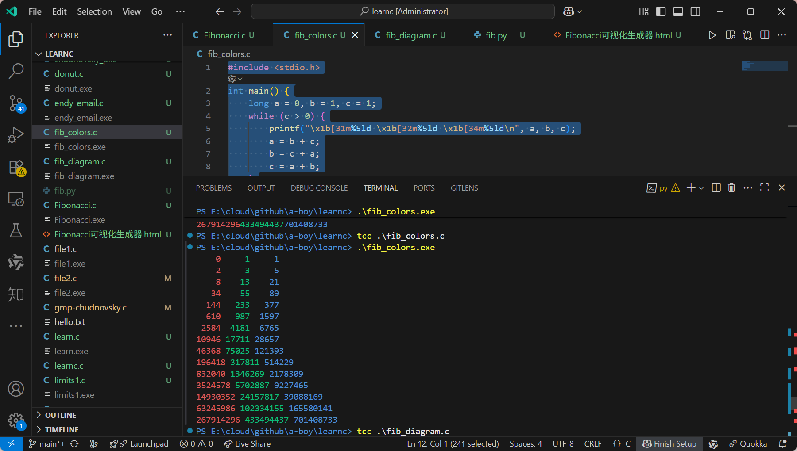

# C语言学习之旅 | Learn C

欢迎来到我的C语言学习项目！该代码库是我学习C语言历程的记录，包含了从基础概念到有趣算法的各种代码示例和实践。

## ✨ 亮点展示

这是一个由 `fib_colors.c` 生成的斐波那契数列的可视化图像，展示了C语言在图形和算法结合方面的魅力。



## 🚀 项目特色

这个仓库中包含了多个有趣的小项目和代码片段：

- **🔢 斐波那契数列**: 多种方式实现斐波那契数列的计算与可视化 (`Fibonacci.c`, `fib_colors.c`, `fib_diagram.c`)。
- **🍩 旋转甜甜圈**: 经典的控制台3D旋转甜甜圈动画 (`donut.c`), 摘自 [a1k0n.net](https://www.a1k0n.net/2021/01/13/optimizing-donut.html) 。
- **🧩 数独游戏**: 一个C语言实现的数独解算器 (`sudoku.c`)。
- **🥧 圆周率计算**: 使用不同算法计算π，包括 Chudnovsky 算法 (`pi.c`, `chudnovsky_pi.c`)。
- **ꡙ‍ maze**: 一个简单的迷宫生成器 (`maze.c`)。
- **🪟 Windows编程**: 使用 WinAPI 进行Windows图形界面编程的尝试 (`mywin.c`, `win987.c`)。
- **🎮 Raylib游戏库**: 使用 Raylib 库进行简单游戏开发的示例 (`raylib123/hiRaylib.c`)。
- **💡 基础概念**: 一些学习C语言核心知识（如数组、指针、文件操作、断言等）的微型程序。

## 🛠️ 如何使用

大部分程序都是独立的 `.c` 文件，可以使用 `tcc`、`gcc` 、`Visual C++` 或其他C编译器轻松编译。

1. **克隆仓库**
   ```
   git clone https://github.com/a-boy/learnc.git
   cd learnc
   ```

2. **编译C文件，运行程序**
   以 `Fibonacci.c` 为例：
   ```PowerShell
      tcc Fibonacci.c
     .\Fibonacci.exe
     :: 使用 ./fibonacci 也会运行.\Fibonacci.exe
   ```

   在 Linux 或 macOS 上:
   ```bash
   gcc Fibonacci.c -o fibonacci
   ./fibonacci
   ```

   > **注意**: 某些程序可能需要链接额外的库。例如，如果用到了数学函数，需要加上 `-lm` 参数。
   
## 📜 许可证

本项目采用 [MIT License](LICENSE) 开源。
